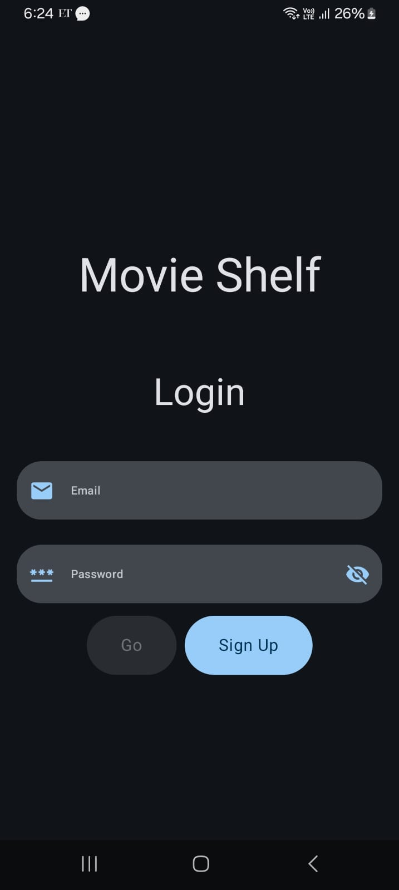
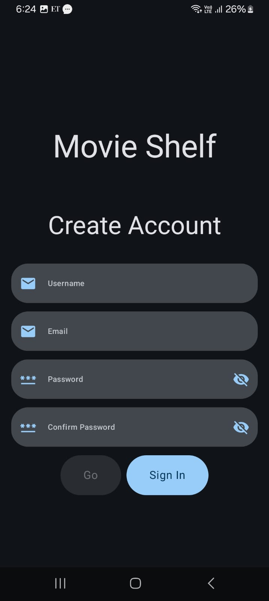
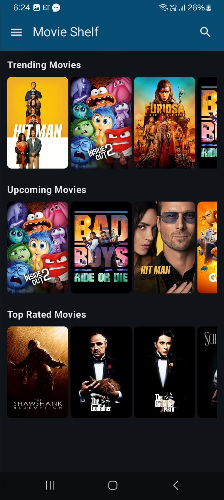
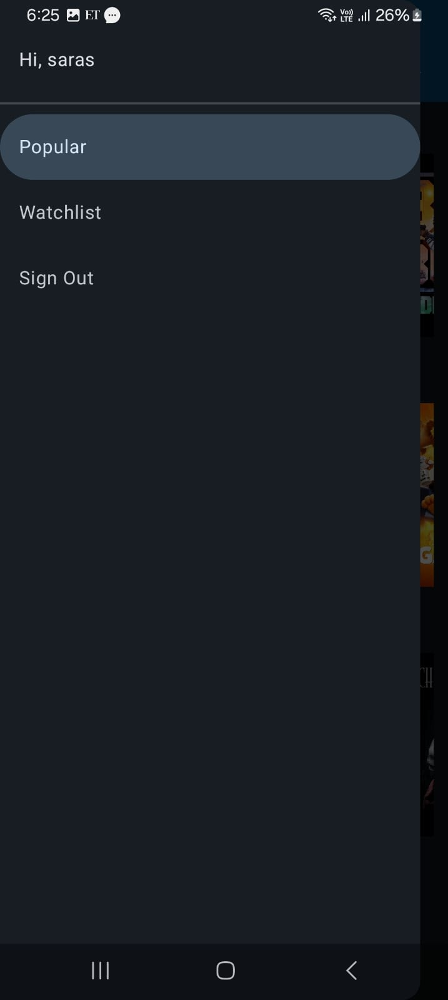
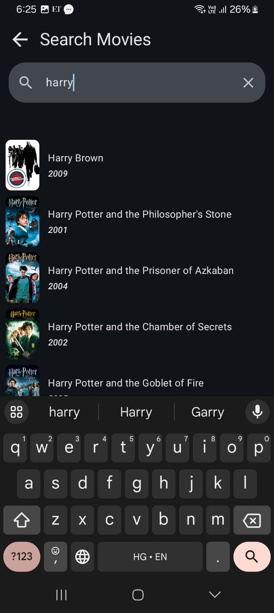
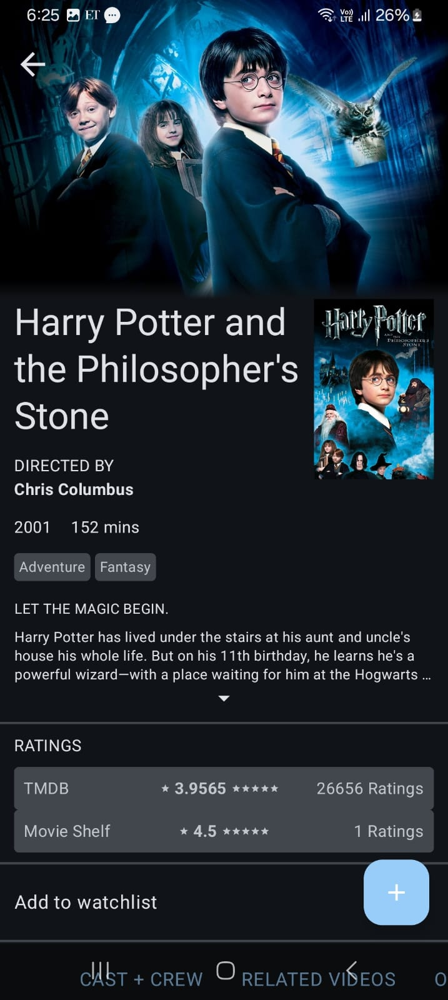
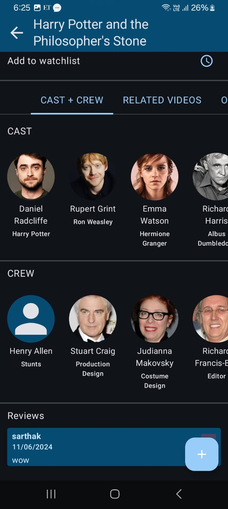
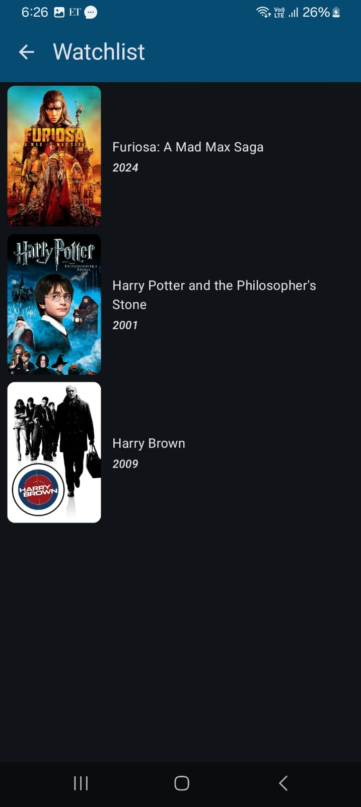

# Movie Shelf App
Movie Shelf is a native android app that allows users to search for movies by title, view movie details, leave reviews and ratings and add movies to watchlist. The app uses the The Movie Database API to search for movies and retrieve movie data. It uses Firebase Authentication (Email & Password). It also uses Firebase Firestore to store data related to users, movies and reviews.

### Features
* Search for movies by title using the TMDB API
* View movie details, including the title, description, genres, cast, crew, rating, etc.
* Leave rating and reviews for movies. (Users can multiple reviews for a movie, though only the latest rating is saved.)
* Add movies to watchlist.
* Authenticate using email/password.

### Technologies and Libraries Used
* Jetpack Compose
* Firebase
* TMDB API
* Retrofit
* Gson Converter
* Kotlin Coroutines
* Dagger-Hilt
* Coil

### Screenshots

### Acknowledgements
The Movie DataBase (TMDB) API
Letterboxd App Design
